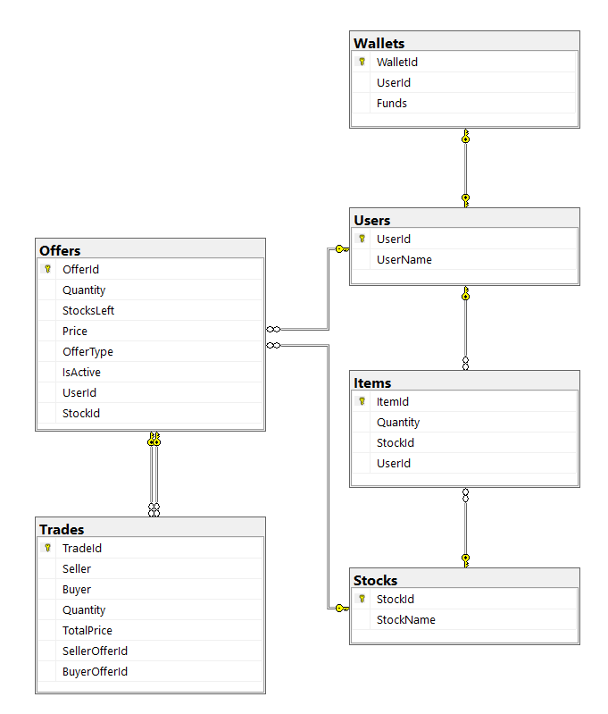
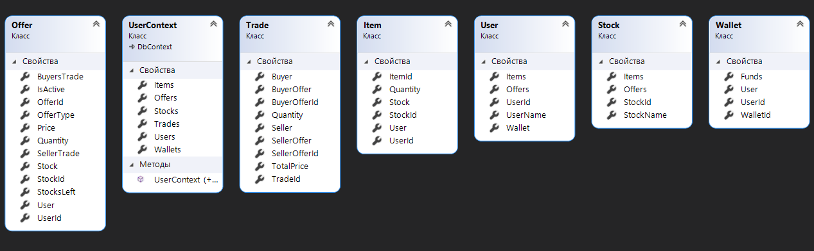

# StocksAPI
Idea was to create a mini stock marketplace API, that runs a background process, which trades existing buy/sell offers.\
Routes:
+ Users:
  * Get
  * Get - /{id}
  * Put - /{id}
  * Get - /User/{id}
+ Wallets:
  * Get
  * Get - /{id}
  * Put - /{id}
  * Post
  * Delete - /{id}
+ Offers:
  * Get
  * Get - /{id}
  * Post
  * Delete - /{id}
+ Trades:
  * Get
  * Get - /{id}
  * Get - /User/{id}
+ Stocks:
  * Get
  * Get - /{id}
  * Put - /{id}
  * Post
  * Delete - /{id}
+ Items:
  * Get
  * Get - /{id}
  * Put - /{id}
  * Post
  * Delete - /{id}
# Schema

# Model

